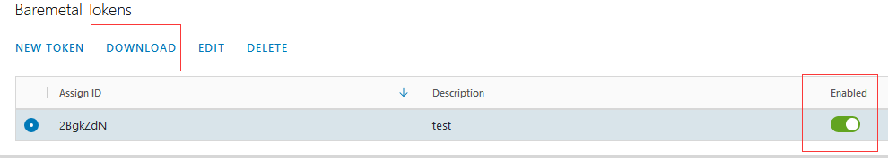

# Bitfusion on Kubernetes ##


Current solutions of GPU virtualization may have some shortcomings:

1.Underutilized GPU compute cycle <br />
2.Limited and preset granularity  <br />
3.Resource bound to local machine  <br />
4.Hard for application scheduling <br />

Bitfusion helps address the problems by providing remote GPU pool. Bitfusion makes GPUs a first class citizen that can be abstracted, partitioned, automated and shared like compute resource. On the other hand, Kubernetes has become the de facto platform to deploy and manage machine learning workloads.

However, out of the box Kubernetes does not offer a way to consume Bitfusion's network-attached GPUs. This limitation becomes a key challenge to enable jobs on Kubernetes to use Bitfusion’s GPU. Kubernetes needs a friendly way to consume Bitfusion GPU resources for the following reasons:  
- Resource management  
- GPU pool management

To address these problems, this project allows Kubernetes to work with Bitfusion.


## Architecture


Bitfusion on Kubernetes consists of the following two components.  
- bitfusion-device-plugin  
- bitfusion-webhook

Component 1 and 2 are built into separated docker images.    
bitfusion-device-plugin runs as a DaemonSet  on each worker node where kubelet is running.  
bitfusion-webhook runs as a Deployment on the Kubernetes master node.  

## Prerequisites 
-  Ubuntu Linux as the operating system of the installation machine 
-  OpenSSL needs to be installed on Ubuntu
-  Kubernetes 1.17+
-  Bitfusion 2.5+
-  kubectl and docker command are ready to use.


### Get Baremetal Token for authorization
In order to enable Bitfusion, users must generate a **Baremetal Token** for authorization and download the related tar file to the installation machine.  
Follow these steps to get the token from the vCenter:  
Step 1. Login to vCenter  
Step 2. Click on **Bitfusion** in Plugins section  
  
Step 3. Select the **Tokens** tab and then  select the proper token to download   
   
Step 4. Click **DOWNLOAD**  button, make sure the token is **Enabled**.  
   
If no tokens are available in the list, click on **NEW TOKEN** to create a Token.  
For more details, please refer to:   
<https://docs.vmware.com/en/VMware-vSphere-Bitfusion/2.5/Install-Guide/GUID-361A9C59-BB22-4BF0-9B05-8E80DE70BE5B.html>


### Create a Kubernetes Secret  using the Baremetal Token

Upload the Baremetal Tokens files to the installation machine. Use the following command to unzip the files:

```shell
$ mkdir tokens    
$ tar -xvf ./2BgkZdN.tar -C tokens
```
Now we have three files in the tokens/  directory: ca.crt, client.yaml and services.conf :

```   
tokens  
├── ca.crt  
├── client.yaml  
└── servers.conf  

```

Then use the following command to create a secret in Kubernetes in the namespace of kube-system:  
```shell
$ kubectl create secret generic bitfusion-secret --from-file=tokens -n kube-system
```
For more details about kubectl:  <https://kubernetes.io/docs/reference/kubectl/overview/>

## Quick Start
There are two deployment options:  
- Using pre-built images   
- Building images from scratch  

### Option 1: Using pre-built images (recommended) 
Use the following command to clone the source code:
```shell
$ git clone https://github.com/vmware/bitfusion-with-kubernetes-integration.git
```
Use the following commands to deploy the **Bitfusion device plugin** and other related components, make sure the Kubernetes cluster has Internet connection.  
```
$ cd bitfusion-with-kubernetes-integration-main/bitfusion_device_plugin
$ make deploy
```

### Option 2: Building images from source 
Instead of using the pre-buit images, users can choose to build the images from source. Optionally, after the images are built, they can be pushed to a registry service (either Docker Hub or an internal registry server). 

Use the following command to clone the source code:
```shell
$ git clone https://github.com/vmware/bitfusion-with-kubernetes-integration.git
```
Modify the values of these variables in the **Makefile** before starting the build process:
```shell
$ cd bitfusion-with-kubernetes-integration-main/bitfusion_device_plugin
$ vim Makefile
```
The values of most of the variables do not need to be changed. If images are to be pushed to a registry service, make sure the vairable **IMAGE_REPO** points to the right registry service of your choice (it defaults to `docker.io/bitfusiondeviceplugin` ): 
```shell
# Variables below are the configuration of Docker images and repo for this project.
# Update these variable values with your own configuration if necessary.

IMAGE_REPO ?= docker.io/bitfusiondeviceplugin
DEVICE_IMAGE_NAME ?= bitfusion-device-plugin
WEBHOOK_IMAGE_NAME ?= bitfusion-webhook
PKG_IMAGE_NAME ?= bitfusion-client
IMAGE_TAG  ?= 0.1
```  

Now start building images using the command below:
```shell
$ make build-image
```
If everything works well, use the following command to check images:
```shell
$ docker images
REPOSITORY                                                                         TAG
docker.io/bitfusiondeviceplugin/bitfusion-device-plugin                            0.1                 
docker.io/bitfusiondeviceplugin/bitfusion-webhook                                  0.1                 
docker.io/bitfusiondeviceplugin/bitfusion-client                                   0.1         

```

(Optional, but recommended) If the images need to be pushed to a registry service, use the following command to push them to the registry service.  
Use “docker login” command to log in to the registry service if necessary.([How to use docker login?](https://docs.docker.com/engine/reference/commandline/login/))
```shell
$ make push-image
```
**NOTE:** If there is no registry service avaialble, images can be exported to a file and then imported to each worker node of the Kubernetes cluster. Use docker command to save the docker images as tar files and distribute them to Kubernetes nodes manually. Then load the images from the tar files on each node. Refer to [document of docker command](https://docs.docker.com/engine/reference/commandline/save/) for more details. 

The next step is to use the following command to deploy the **Bitfusion device plugin** and other related components:
```shell
$ make deploy
```

### Verifying the deployment  
After the installation is completed either via Option 1 or Option 2, use the following command to see if all components have been started properly in the namespace `bwki`:  

Check to see if the Device Plugin is running:
```shell
$ kubectl get pods -n kube-system

NAME                            READY   STATUS    RESTARTS   AGE
bitfusion-device-plugin-cfr87   1/1     Running   0          6m13s 
```
Check to see if the Webhook  is running:
```shell
$ kubectl  get pod -n bwki 

NAME                                            READY   STATUS    RESTARTS   AGE
bitfusion-webhook-deployment-6dbc6df664-td6t7   1/1     Running   0          7m49s 
``` 

Check other deployment components
```shell
$ kubectl get configmap -n bwki

NAME                                DATA   AGE
bwki-webhook-configmap              1      71m
```
```shell
$ kubectl get serviceaccount  -n bwki

NAME                           SECRETS   AGE
bitfusion-webhook-deployment   1         72m
```
```shell
$ kubectl get ValidatingWebhookConfiguration  -n bwki

NAME                          CREATED AT
validation.bitfusion.io-cfg   2021-03-25T05:29:17Z
```
```shell
$ kubectl get MutatingWebhookConfiguration   -n bwki

NAME                          CREATED AT
bwki-webhook-cfg              2021-03-25T05:29:17Z
```
```shell
$ kubectl get svc   -n bwki

NAME                          TYPE        CLUSTER-IP    EXTERNAL-IP   PORT(S)   AGE
bwki-webhook-svc              ClusterIP   10.101.39.4   <none>        443/TCP   76m
```


## Using Bitfusion GPU in Kubernetes workload 

After completing the installation, users can write a YAML file of Kubernetes to consume the Bitfusion resources. There are three parameters related to Bitfusion resource in a YAML file:  
- auto-management/bitfusion: yes / no  
  Use this annotation to describe whether Bitfusion device plugin is enabled for this workload.
- bitfusion.io/gpu-num:  
  Number of GPU the workload requires from the Bitfusion cluster
- bitfusion.io/gpu-percent:  
  Percentage of the memory of each GPU 

Below is a sample YAML of Pod which runs a benchmark of Tensorflow. The variable `hostPath` is the directory where the Tensorflow Benchmarks code resides on the host and it will be mounted into the pod.

```yaml
apiVersion: v1
kind: Pod
metadata:
  annotations:
    # "yes" stands for Bitfusion device plugin is enabled for this Pod.
    auto-management/bitfusion: "yes"
  name: bf-pkgs
  # You can specify any namespace
  namespace: tensorflow-benchmark
spec:
  containers:
    - image: nvcr.io/nvidia/tensorflow:19.07-py3
      imagePullPolicy: IfNotPresent
      name: bf-pkgs
      command: ["python /benchmark/scripts/tf_cnn_benchmarks/tf_cnn_benchmarks.py --local_parameter_device=gpu --batch_size=32 --model=inception3"]
      resources:
        limits:
          # Request one GPU for this Pod from the Bitfusion cluster
          bitfusion.io/gpu-num: 1
          # 50 percent of each GPU to be consumed
          bitfusion.io/gpu-percent: 50
      volumeMounts:
        - name: code
          mountPath: /benchmark
    volumes:
        - name: code
          # The Benchmarks used for the test came from: https://github.com/tensorflow/benchmarks/tree/tf_benchmark_stage 
          # Please make sure you have the corresponding content in /home/benchmarks directory on your node
          hostPath:
            path: /home/benchmarks
```
 
Then apply the yaml with the following command to deploy:

```shell
$ kubectl create namespace tensorflow-benchmark
$ kubectl create -f example/pod.yaml
```

**If the Pod runs successfully, the output looks like below:**
```text
[INFO] 2021-03-27T04:26:40Z Query server 192.168.1.100:56001 gpu availability
[INFO] 2021-03-27T04:26:41Z Choosing GPUs from server list [192.168.1.100:56001]
[INFO] 2021-03-27T04:26:41Z Requesting GPUs [0] with 8080 MiB of memory from server 0, with version 2.5.0-fd3e4839...
Requested resources:
Server List: 192.168.1.100:56001
Client idle timeout: 0 min
[INFO] 2021-03-27T04:26:42Z Locked 1 GPUs with partial memory 0.5, configuration saved to '/tmp/bitfusion125236687'
[INFO] 2021-03-27T04:26:42Z Running client command 'python /benchmark/scripts/tf_cnn_benchmarks/tf_cnn_benchmarks.py --local_parameter_device=gpu --batch_size=32 --model=inception3' on 1 GPUs, with the following servers:
[INFO] 2021-03-27T04:26:42Z 192.168.1.100 55001 ab4a56d5-8df4-4c93-891d-1c5814cf83f6 56001 2.5.0-fd3e4839

2021-03-27 04:26:43.511803: I tensorflow/stream_executor/platform/default/dso_loader.cc:42] Successfully opened dynamic library libcudart.so.10.1

......

Instructions for updating:
non-resource variables are not supported in the long term
2021-03-27 04:26:48.173243: I tensorflow/core/platform/profile_utils/cpu_utils.cc:94] CPU Frequency: 2394455000 Hz
2021-03-27 04:26:48.174378: I tensorflow/compiler/xla/service/service.cc:168] XLA service 0x4c8ad60 executing computations on platform Host. Devices:
2021-03-27 04:26:48.174426: I tensorflow/compiler/xla/service/service.cc:175]   StreamExecutor device (0): <undefined>, <undefined>
2021-03-27 04:26:48.184024: I tensorflow/stream_executor/platform/default/dso_loader.cc:42] Successfully opened dynamic library libcuda.so.1
2021-03-27 04:26:54.831820: I tensorflow/stream_executor/cuda/cuda_gpu_executor.cc:1005] successful NUMA node read from SysFS had negative value (-1), but there must be at least one NUMA node, so returning NUMA node zero
2021-03-27 04:26:55.195722: I tensorflow/compiler/xla/service/service.cc:168] XLA service 0x4c927b0 executing computations on platform CUDA. Devices:
2021-03-27 04:26:55.195825: I tensorflow/compiler/xla/service/service.cc:175]   StreamExecutor device (0): Tesla V100-PCIE-16GB, Compute Capability 7.0
2021-03-27 04:26:56.476786: I tensorflow/stream_executor/cuda/cuda_gpu_executor.cc:1005] successful NUMA node read from SysFS had negative value (-1), but there must be at least one NUMA node, so returning NUMA node zero
2021-03-27 04:26:56.846965: I tensorflow/core/common_runtime/gpu/gpu_device.cc:1640] Found device 0 with properties:
name: Tesla V100-PCIE-16GB major: 7 minor: 0 memoryClockRate(GHz): 1.38
pciBusID: 0000:00:00.0
2021-03-27 04:26:56.847095: I tensorflow/stream_executor/platform/default/dso_loader.cc:42] Successfully opened dynamic library libcudart.so.10.1
2021-03-27 04:26:56.858148: I tensorflow/stream_executor/platform/default/dso_loader.cc:42] Successfully opened dynamic library libcublas.so.10
2021-03-27 04:26:56.870662: I tensorflow/stream_executor/platform/default/dso_loader.cc:42] Successfully opened dynamic library libcufft.so.10
2021-03-27 04:26:56.872082: I tensorflow/stream_executor/platform/default/dso_loader.cc:42] Successfully opened dynamic library libcurand.so.10
2021-03-27 04:26:56.884804: I tensorflow/stream_executor/platform/default/dso_loader.cc:42] Successfully opened dynamic library libcusolver.so.10
2021-03-27 04:26:56.891062: I tensorflow/stream_executor/platform/default/dso_loader.cc:42] Successfully opened dynamic library libcusparse.so.10
2021-03-27 04:26:56.916430: I tensorflow/stream_executor/platform/default/dso_loader.cc:42] Successfully opened dynamic library libcudnn.so.7
2021-03-27 04:26:57.108177: I tensorflow/stream_executor/cuda/cuda_gpu_executor.cc:1005] successful NUMA node read from SysFS had negative value (-1), but there must be at least one NUMA node, so returning NUMA node zero
2021-03-27 04:26:57.699172: I tensorflow/stream_executor/cuda/cuda_gpu_executor.cc:1005] successful NUMA node read from SysFS had negative value (-1), but there must be at least one NUMA node, so returning NUMA node zero
2021-03-27 04:26:58.487127: I tensorflow/core/common_runtime/gpu/gpu_device.cc:1763] Adding visible gpu devices: 0
2021-03-27 04:26:58.487327: I tensorflow/stream_executor/platform/default/dso_loader.cc:42] Successfully opened dynamic library libcudart.so.10.1
2021-03-27 04:53:53.568256: I tensorflow/core/common_runtime/gpu/gpu_device.cc:1181] Device interconnect StreamExecutor with strength 1 edge matrix:
2021-03-27 04:53:53.568703: I tensorflow/core/common_runtime/gpu/gpu_device.cc:1187]      0
2021-03-27 04:53:53.569011: I tensorflow/core/common_runtime/gpu/gpu_device.cc:1200] 0:   N
2021-03-27 04:53:53.939681: I tensorflow/stream_executor/cuda/cuda_gpu_executor.cc:1005] successful NUMA node read from SysFS had negative value (-1), but there must be at least one NUMA node, so returning NUMA node zero
2021-03-27 04:53:54.482940: I tensorflow/stream_executor/cuda/cuda_gpu_executor.cc:1005] successful NUMA node read from SysFS had negative value (-1), but there must be at least one NUMA node, so returning NUMA node zero
2021-03-27 04:53:54.846537: I tensorflow/core/common_runtime/gpu/gpu_device.cc:1326] Created TensorFlow device (/job:localhost/replica:0/task:0/device:GPU:0 with 7010 MB memory) -> physical GPU (device: 0, name: Tesla V100-PCIE-16GB, pci bus id: 0000:00:00.0, compute capability: 7.0)

......

TensorFlow:  1.14
Model:       inception3
Dataset:     imagenet (synthetic)
Mode:        training
SingleSess:  False
Batch size:  32 global
             32 per device
Num batches: 100
Num epochs:  0.00
Devices:     ['/gpu:0']
NUMA bind:   False
Data format: NCHW
Optimizer:   sgd
Variables:   parameter_server
==========
Generating training model
Initializing graph
Running warm up
Done warm up
Step    Img/sec total_loss
1       images/sec: 199.4 +/- 0.0 (jitter = 0.0)        7.312
10      images/sec: 196.6 +/- 2.1 (jitter = 5.7)        7.290
20      images/sec: 198.3 +/- 1.3 (jitter = 4.5)        7.351
30      images/sec: 198.4 +/- 0.9 (jitter = 3.8)        7.300
40      images/sec: 199.4 +/- 0.8 (jitter = 4.1)        7.250
50      images/sec: 199.8 +/- 0.7 (jitter = 4.6)        7.283
60      images/sec: 200.1 +/- 0.6 (jitter = 4.2)        7.301
70      images/sec: 199.8 +/- 0.6 (jitter = 4.2)        7.266
80      images/sec: 200.1 +/- 0.6 (jitter = 4.4)        7.286
90      images/sec: 199.9 +/- 0.5 (jitter = 4.4)        7.334
100     images/sec: 199.9 +/- 0.5 (jitter = 4.0)        7.380
----------------------------------------------------------------
total images/sec: 199.65
----------------------------------------------------------------

......


```
Use the following command to remove POD when the job is finished:
```
$ kubectl delete -f example/pod.yaml
```


## Troubleshooting

- If the workload did not run successfully, use the command below to check the log for details.  
```shell
$ kubectl logs -n tensorflow-benchmark   bf-pkgs
```
"tensorflow-benchmark" is the namespace of the pod.
"bf-pkgs" is the pod name.

The logs below indicate some errors of contacting Bitfusion server.
   

Check the validity of the **Bitfusion token** from vCenter Bitfusion Plugin. 
Re-download a new validate token and use the following commands to update the secret in Kubernetes:  (Make sure to delete all the stale bitfusion-secret in each namespace of Kubernetes)
```
$ kubectl delete secret -n kube-system bitfusion-secret  
$ kubectl delete secret -n tensorflow-benchmark  bitfusion-secret  
$ kubectl create secret generic bitfusion-secret --from-file=tokens -n kube-system
```  

